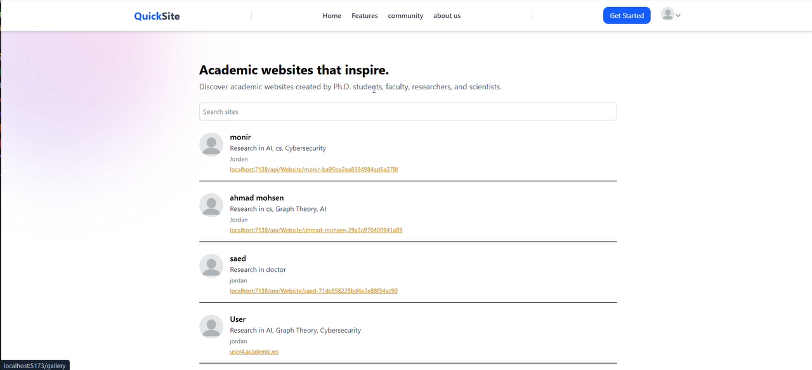
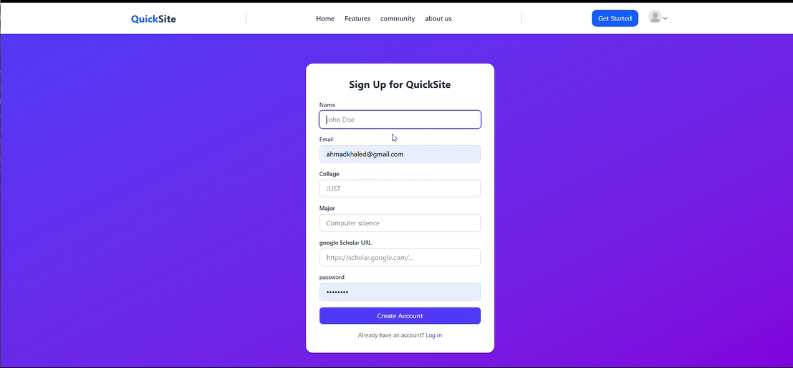
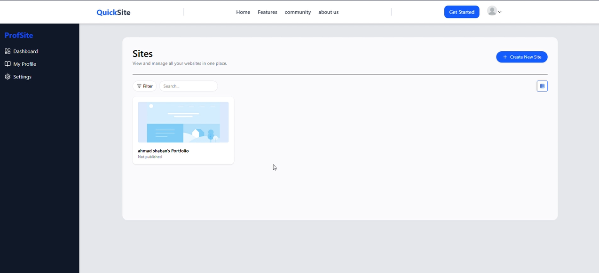
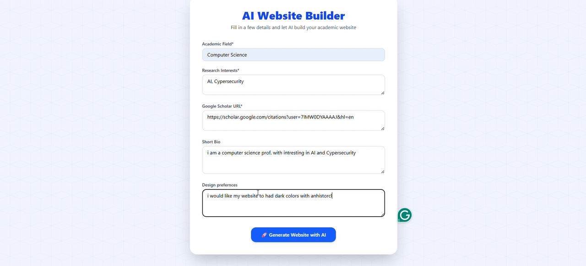
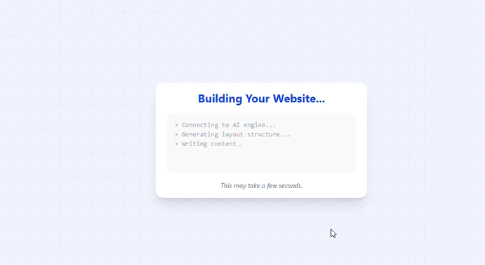

# QuickSite

QuickSite is an AI-powered Academic-Website-Builder designed to help academics create professional websites effortlessly. It automates the process of building a website, integrating publications, and managing content, allowing researchers to focus on their work.


### 🧹 Tech Stack

* **Frontend**: React (with Vite), JavaScript, Tailwind CSS
* **Backend**: ASP.NET Core Web API
* **Database**: SQL Server DB
* **Package Manager**: Yarn (frontend), .NET CLI (backend)

---

## ✅ Features

* 🔐 User authentication
* 📄 CRUD operations
* ⚡ Fast dev experience with Vite
* 🔌 RESTful API with ASP.NET Core
*  $ Payment gate using Paypal

---


## 📂 Project Structure

```
/project-root(Quicksite)
│
├── /frontend     # React app (Vite)
│
└── /backend      # ASP.NET Core Web API
```
---

## 📖 License

MIT – feel free to use and modify.

---







